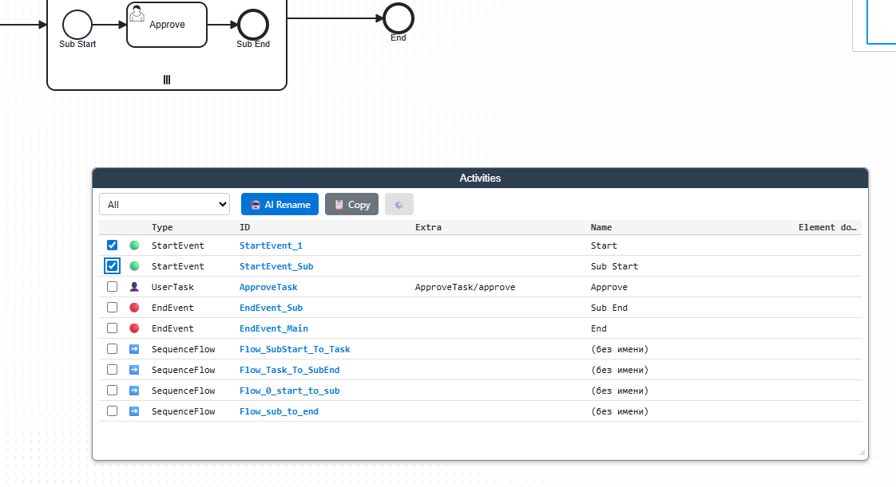
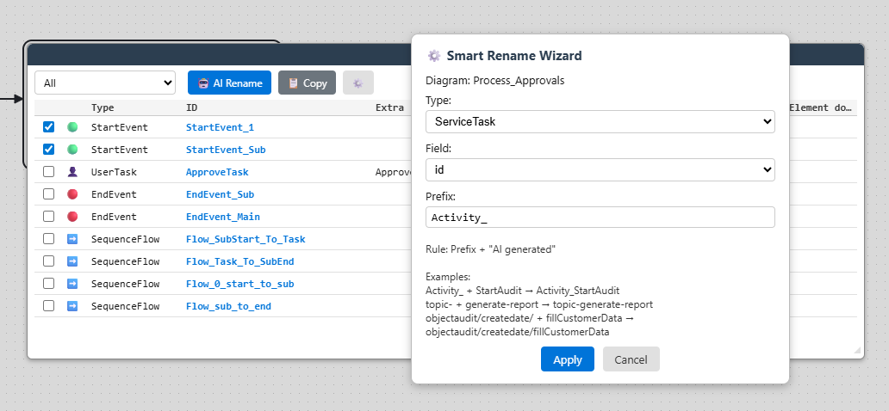
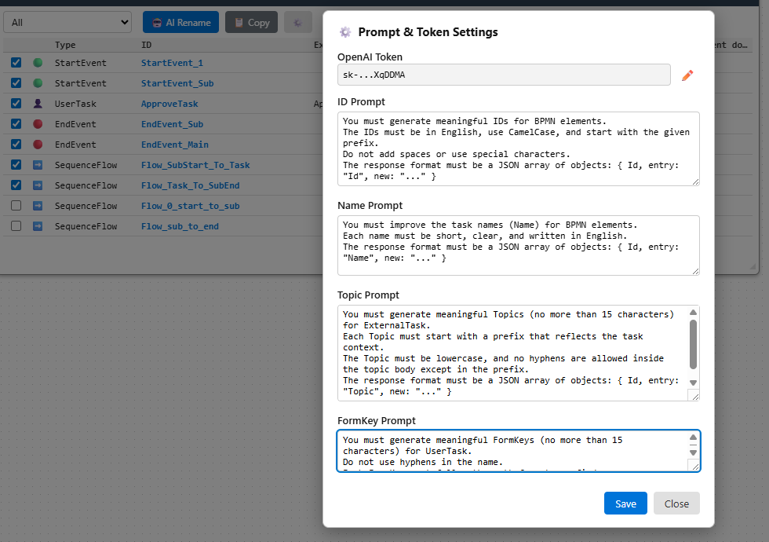
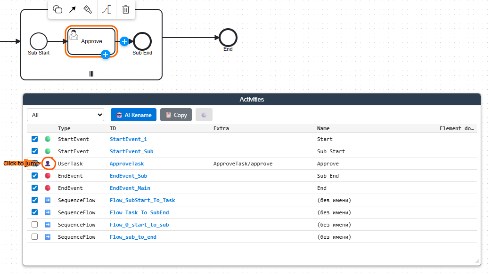

# Camunda Extend Activity Editor

An advanced extension for **Camunda Modeler** that enhances activity management in BPMN diagrams.  
The plugin adds a full Activity Editor panel with:

- Activity list (UserTask, ServiceTask, Gateways, Events, CallActivity, SequenceFlow, Message Events)
- On-diagram navigation (focus + highlight)
- Inline ID editing
- AI Smart Rename (IDs, Names, Topics, FormKey)
- Customizable prompts (Prompt Settings Dialog)
- Filters by BPMN type
- Table export (Markdown)
- Draggable & resizable UI panel
- Documentation preview
- Persistent selection and sort state

This plugin is designed to make working with complex BPMN diagrams significantly easier and faster, especially when many tasks require renaming, organizing, or documenting.

---

## Screenshots


### Activity Editor Panel


### Smart Rename with AI


### AI Settings


### Click the Activity Icon to Focus the Element on the Diagram


---

## Features

### 🔍 Activity List Panel
Displays all BPMN elements supported by the editor:

- UserTask  
- ServiceTask (external)
- StartEvent  
- EndEvent  
- ExclusiveGateway  
- ParallelGateway  
- BoundaryEvent  
- IntermediateCatchEvent  
- IntermediateThrowEvent  
- Message Events  
- CallActivity  
- SequenceFlow

Each entry shows:

- ID  
- Name  
- Type  
- Topic / FormKey (when applicable)  
- Element documentation  

### ➡️ Jump to Element
Click the icon to focus the BPMN element:

- Centers the canvas
- Highlights the element
- Selects it in the modeler

### ✏️ Inline ID Editing
Click the ID in the table → edit → Enter.  
The plugin automatically updates BPMN model properties.

### 🤖 AI Smart Rename
Uses OpenAI API to rename:

- IDs  
- Names  
- ServiceTask Topics  
- UserTask FormKeys  

Supports:

- Type selection  
- Field selection  
- Custom prefix per type/field  
- Automatic prefix storage per diagram  
- Strict JSON-only response validation  

Configured via **Prompt Settings Dialog**.

### ⚙️ Prompt & Token Settings Dialog
Allows editing:

- OpenAI token  
- Prompts for:
  - ID generation  
  - Name generation  
  - Topic generation  
  - FormKey generation  

Stored in browser `localStorage`.

### 🧩 Filters
Filter the list by BPMN type:

- All
- UserTask
- ServiceTask
- ParallelGateway
- ExclusiveGateway
- StartEvent
- EndEvent
- BoundaryEvent
- Intermediate Events
- CallActivity
- SequenceFlow
- Message Events

### 📋 Export Table (Markdown)
Copies the current activity list into the clipboard as a Markdown table.

### 🖱️ Drag & Resize UI
The Activity Editor panel supports:

- Dragging  
- Vertical/horizontal resizing  
- Auto-refresh on diagram changes  

---

## Installation

Copy the plugin folder to:

### Windows
```
%APPDATA%/camunda-modeler/plugins/
```

### Linux
```
~/.config/Camunda Modeler/plugins/
```

### macOS
```
~/Library/Application Support/Camunda Modeler/plugins/
```

Restart Camunda Modeler.

---

## Build

### Install dependencies
```
npm install
```

### Build once
```
npm run client
```

### Auto-rebuild on changes
```
npm run auto-build
```

This produces:

```
client/client-bundle.js
```

---

## File Structure

```
camunda-extend-activity-editor/
 ├─ index.js
 ├─ client/
 │   ├─ client.js
 │   ├─ client-bundle.js      <- (browserify-generated bundle)
 │   ├─ ActivityListPlugin.js
 │   ├─ ActivityListUI.js
 │   ├─ ActivityListUpdater.js
 │   ├─ FocusAndSelectElement.js
 │   ├─ OpenAiClient.js
 │   ├─ PromptSettingsDialog.js
 │   ├─ SmartRenameWizard.js
 │   └─ PluginLog.js
 ├─ menu/
 │   └─ menu.js
 ├─ style/
 │   └─ style.css
 ├─ package.json
 └─ README.md
```

---

## Compatibility
Tested with:

- Camunda Modeler 5.x
- bpmn-js 0.22.x

---

## License
MIT
